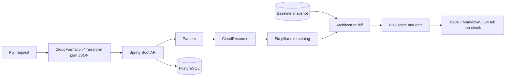

# ChangeGuard

Pre-deployment architecture risk engine for AWS infrastructure.

A deployment can succeed and still make an architecture worse. ChangeGuard evaluates generated infrastructure artifacts before deployment, identifies new risks relative to a baseline, and returns a deployment gate with an auditable report.

## Why ChangeGuard Exists

Syntactically valid infrastructure can introduce public databases, wildcard IAM grants, unencrypted volumes, missing backups or stateful replacements. ChangeGuard makes these changes visible during review. It is a Java static-analysis project, with no AI dependency.

## Demo

Example using the supplied Terraform regression fixture:

```text
AWS Architecture Review
──────────────────────────────────────────
Overall                  70/100
Security                 80
Reliability              90

NEW REGRESSIONS
CRITICAL  RDS public access enabled
HIGH      RDS Multi-AZ disabled

Deployment Gate: FAILED
```

```sh
docker compose up -d --build --wait
python scripts/scan.py fixtures/good/production.json
python scripts/scan.py fixtures/bad/terraform-public-rds.json --format TERRAFORM_PLAN
# The second command intentionally exits 1. JSON and Markdown are in reports/.
```

Fixtures demonstrate analysis controls; they are not complete deployable AWS stacks. Nothing in the demo deploys AWS infrastructure.

## Architecture



Java 21, Spring Boot 3.5, Spring Data JPA, PostgreSQL, Flyway, Jackson, Caffeine, AWS SDK v2, Micrometer, Docker, JUnit 5, Mockito and Testcontainers. See [architecture](docs/architecture.md), [rule engine](docs/rule-engine.md), and [threat model](docs/threat-model.md).

## Architecture Review Lifecycle

1. Submit a generated template or saved plan JSON, optionally with a stored baseline.
2. Parse immutable resources and preserve unknown values.
3. Evaluate applicable policies and classify new, existing and resolved findings.
4. Add destructive-change checks, apply dated exceptions, and calculate scores/gates.
5. Commit the review, snapshot, findings, rule versions and exception evidence atomically.
6. Fetch the report, capture a milestone, or promote the review to a named baseline.

## Supported Inputs

| Input | Support |
|---|---|
| CloudFormation JSON | Resource properties, intrinsic values retained as unknown |
| CDK synthesized JSON | Same path as CloudFormation; unresolved expressions remain unknown |
| Terraform `show -json` plan | Format 1.x, before/after values, nested modules, unknowns, delete/replacement actions |
| CloudFormation change set JSON | Complete `Changes` array plus baseline and proposed templates; conditional replacement treated conservatively |
| CloudFormation YAML / Terraform HCL | Not parsed; produce JSON first |

The shipped catalog covers 18 CloudFormation resource types: RDS DBInstance, S3 Bucket, IAM Policy/Role, EC2 SecurityGroup/Volume/Instance, SQS Queue, SNS Topic, ElastiCache ReplicationGroup, CloudTrail Trail, DynamoDB Table, AutoScalingGroup, ECS Service, Logs LogGroup, CloudWatch Alarm, Lambda Function, and ECR Repository. Terraform maps corresponding resource types, but not every provider-specific property shape or split resource configuration is supported. Unsupported types and unresolved checks are visible and block the gate.

## Normalized Resource Model

```java
public record CloudResource(
    String resourceId,
    String resourceType,
    Map<String, Object> properties
) {}
```

Properties are deeply immutable. Canonical keys follow CloudFormation names such as `MultiAZ` and `StorageEncrypted`. Rules depend only on this model. Terraform addresses remain resource IDs so module resources stay distinct.

## Rule Engine

**42 declarative policies** plus stateful-destruction and alarm-removal checks. Policy metadata includes version, rationale, recommendation and documentation. The evaluator supports property comparisons, presence checks, allow-list membership, IAM wildcard checks and public administrative ingress checks. Rules load from JSON files; change a trusted external catalog and restart to deploy policies without recompiling.

See [policy definitions](rules) and [operator semantics](docs/rule-engine.md). Rules about resource sizing, ARM adoption and capacity are marked heuristics, not universal architecture requirements. Missing explicit configuration is distinct from knowledge of AWS account defaults. This is a bounded policy checker, not a full IAM authorization simulator or compliance certification.

## AWS Well-Architected Mapping

| Pillar | Catalog rules |
|---|---:|
| Security | 12 |
| Reliability | 10 |
| Operational excellence | 8 |
| Performance efficiency | 4 |
| Cost optimization | 4 |
| Sustainability | 4 |

These are locally defined policies inspired by the framework, not an implementation of every AWS best practice. The [AWS Well-Architected Framework](https://docs.aws.amazon.com/wellarchitected/latest/framework/welcome.html) supplies architectural context. A separate [Agent Platform policy example](docs/examples/agent-platform-lens.json) contains six organization rules and is not enabled in the default catalog.

## Architecture Risk Score

`score = max(0, 100 - penalties)` with INFO=0, LOW=2, MEDIUM=5, HIGH=10, CRITICAL=20. Each pillar gets the same calculation for its own active failures. Suppressed failures do not subtract points. Unassessed pillars have `score: null`; a score of 100 does not override an incomplete-analysis failure.

## Change / Regression Detection

Supply `baselineTemplate` or `baselineReviewId`. Both snapshots use the current catalog. Findings match on rule ID and resource ID: NEW, EXISTING or RESOLVED. Reports include changed property names and SAFE / NEUTRAL / RISK_INCREASE / RISK_REDUCTION classification. Raw property values are omitted from findings and Markdown. Terraform plans supply a before snapshot automatically. State-based diffs alone do not predict all AWS replacement behavior; include the provider's planned actions or a complete CloudFormation change set.

## Deployment Quality Gates

Default policy: minimum score 80, no CRITICAL findings, at most two HIGH findings. PASS means no active findings; WARN means findings remain within thresholds; FAIL means a threshold or completeness requirement failed. The CLI exits nonzero for FAIL and transport errors. GitHub branch protection must require the job for it to block merging.

```json
"qualityGate": {
  "minimumScore": 80,
  "failOn": ["CRITICAL"],
  "maxHighFindings": 2,
  "regressionsOnly": true
}
```

Regression mode exposes the overall score and a separate `gateScore` calculated only from new failures. Destructive stateful changes and incomplete analysis cannot be waived through these thresholds. Production CI must protect gate configuration from PR authors.

## Suppressions

```json
"suppressions": [{
  "rule": "REL-RDS-001",
  "resource": "dev-database",
  "reason": "Non-production sandbox approved by the service owner",
  "expires": "2026-10-01"
}]
```

Expiration must be after today's UTC date. Exceptions are stored and remain visible. They are exact matches, cannot be permanent, and cannot hide unknowns/errors or destructive stateful changes. Change checks currently require review rather than suppression.

## Terraform Integration

```sh
terraform plan -out=tfplan
terraform show -json tfplan > tfplan.json
python scripts/scan.py tfplan.json --format TERRAFORM_PLAN
```

ChangeGuard never runs HCL or Terraform itself. It handles managed resource before/after values and action sequences, including replacement. Terraform JSON can contain sensitive plaintext; protect the artifact. See HashiCorp's [JSON format specification](https://developer.hashicorp.com/terraform/internals/json-format).

## CloudFormation Integration

`POST /v1/reviews` accepts a template as a JSON string:

```json
{
  "format": "CLOUDFORMATION",
  "template": "{\"Resources\":{\"Data\":{\"Type\":\"AWS::EC2::Volume\",\"Properties\":{\"Encrypted\":true,\"VolumeType\":\"gp3\"}}}}"
}
```

For change-set analysis, also provide `baselineTemplate`/`baselineReviewId` and `changeSet` as a JSON string containing the complete AWS `DescribeChangeSet` output. A change set alone is not a full proposed property snapshot. Paginated output must be merged before submission.

## GitHub Actions Integration

[Architecture workflow](.github/workflows/architecture-review.yml) starts an isolated local service, scans a fixture, uploads reports and uses the job result as the PR check. In a workload repository, replace the fixture path with the actual generated deployment artifact and pass a trusted baseline. The supplied workflow is a working demonstration, not automatic discovery of your infrastructure files. It uses no AWS credentials or PR-comment permissions.

## PostgreSQL Data Model

Tables: `review`, `resource`, `finding`, `rule_definition`, `review_milestone`, `architecture_baseline`. Flyway creates the schema; JPA validates it. Snapshots and reports are immutable history. Send `Idempotency-Key` to serialize retries across replicas. Identical keys with different requests return 409. Changing a rule without bumping its stored version aborts the review.

| Endpoint | Purpose |
|---|---|
| `POST /v1/reviews` | Evaluate and persist |
| `GET /v1/reviews/{id}` | Full report |
| `GET /v1/reviews/{id}/markdown` | PR summary |
| `GET /v1/rules` | Current metadata |
| `POST /v1/reviews/{id}/milestones` | Body `{"name":"checkout-v3"}` |
| `GET /v1/reviews/{id}/milestones` | Milestone history |
| `PUT /v1/baselines/{name}` | Body `{"reviewId":"<UUID>"}` |
| `GET /v1/baselines/{name}` | Resolve a named baseline to its review ID |

## AWS Well-Architected Tool Integration

Disabled by default. Set `AWS_INTEGRATION_ENABLED=true`, `AWS_REGION`, and provide credentials through the AWS SDK default chain. Optional endpoints create/reference workloads, retrieve lens risk counts and answers, create milestones with caller-supplied idempotency tokens, and retrieve review reports. `GET /v1/aws/workloads/{id}/lenses/{lens}?milestone=N` reads historical context; compare milestone responses independently of ChangeGuard scores.

The adapter is unit-tested with mocked AWS responses. **No live AWS workload was created or modified during local verification.** Publishing a real custom AWS lens and importing automated findings into AWS answers remain future integration work. See [AWS API reference](https://docs.aws.amazon.com/wellarchitected/latest/APIReference/Welcome.html).

## Performance

The synthetic engine experiment runs 5,000 resources × 100 synthetic predicates = 500,000 applicable checks. Five samples per mode, Microsoft Java 21.0.12.1 on Windows 11, 8 reported processors:

| Threads | Cold P50 | Cold P95 | Warm P50 | Warm P95 |
|---:|---:|---:|---:|---:|
| 1 | 2006 ms | 2732 ms | 766 ms | 1058 ms |
| 4 | 898 ms | 1039 ms | 268 ms | 551 ms |
| 8 | 706 ms | 998 ms | 233 ms | 346 ms |
| 16 | 786 ms | 851 ms | 207 ms | 300 ms |

Eight threads had the best median cold throughput in this small run; sixteen did not improve it. Cache hits improve repeated scans, but concurrency/GC/noise affect results. These numbers exclude parsing, HTTP, SQL and AWS; **they do not establish an API P95 below two seconds**. Five samples are exploratory, not a production capacity study. [Harness and methodology](load-tests/README.md), [recorded results](docs/results/engine.json).

A separate local k6 run sent 20 HTTP reviews with two concurrent users, each containing 5,000 EBS resources (10,000 applicable catalog checks per review), through the Dockerized API and PostgreSQL. All requests/checks passed; HTTP median was 405 ms and P95 was 1.45 s. This small local run includes parsing and persistence but is not the 100-rule engine workload above or a production SLO. [Raw HTTP results](docs/results/api-load.txt).

## Evaluation Results

The deterministic suite uses **150 synthetic variations of 15 hand-authored mutation cases**, not 150 independently designed real architectures:

| Measurement | Result |
|---|---:|
| Secure variations | 60 |
| Intentionally unsafe variations | 90 |
| Unsafe variations detected | 90/90 |
| Critical variations blocked | 30/30 |
| False positives in secure variations | 0/60 |

These results apply only to this fixture suite and do not establish production recall or false-positive rates. [Recorded evaluation](docs/results/scenarios.json). `mvn verify` also runs parser, operator, regression, concurrency, AWS-adapter and PostgreSQL/API tests; raw reports are under `target/surefire-reports` and `target/failsafe-reports`.

Local verification passed **188 tests**: 182 unit/scenario tests and 6 actual PostgreSQL integration tests, with no failures or skips. Integration tests include pausing PostgreSQL, checking HTTP 503, restoring it, and retrying without duplicate persistence. The container smoke test returned PASS/100 for the secure fixture and FAIL/70 for the [Terraform regression demo](docs/results/demo-review.json). Docker image build and Terraform validation/format checks also passed; Terraform validation used Linux Docker because the workstation's Windows provider TLS handshake failed.

## Failure Handling

Malformed input returns 400. Unknown review IDs return 404; idempotency conflicts return 409. Rule exceptions produce RULE_ERROR findings and fail the gate without aborting the other checks. Database failures return 503 and roll back persistence; callers can retry with the same key. AWS context uses bounded SDK timeouts/retries and returns 503 on failure. No scan result is fabricated when a dependency fails.

## Observability

`/actuator/health` and `/actuator/prometheus` expose health and metrics. Counters include reviews, findings, critical findings, gate failures, suppressions and regressions. Timers include review and rule latency; `architecture_score` records score distributions. Counters are process metrics for evaluation attempts, not a transactional audit count of committed reviews.

```sh
docker compose --profile observability up -d
```

Grafana: `http://localhost:3000` (`admin` / `changeguard-local` for local development). Prometheus: `http://localhost:9090`. Dashboard provisioning is included. If an API key is configured, provide it privately in the Prometheus scrape configuration.

## Running Locally

Prerequisites: Java 21 and Docker; Maven wrapper is included.

```sh
docker compose up -d postgres --wait
sh mvnw spring-boot:run
# Windows: .\mvnw.cmd spring-boot:run
```

Or use `docker compose up -d --build --wait` for the full container stack. Import `pom.xml` as a Maven project in IntelliJ and select JDK 21. The original starter `src/Main.java` has been replaced by `com.changeguard.ChangeGuardApplication`.

Environment variables: `DATABASE_URL`, `DATABASE_USER`, `DATABASE_PASSWORD`, `CHANGEGUARD_API_KEY`, `SERVER_ADDRESS`, `EVALUATION_THREADS` (1–16), `RULES_LOCATION`, `AWS_INTEGRATION_ENABLED`, `AWS_REGION`. Local database credentials default to `changeguard/changeguard`; the host listener defaults to loopback.

On this Windows workstation, [local-maven.ps1](scripts/local-maven.ps1) locates IntelliJ Maven and the locally downloaded JDK and uses Windows certificate trust. Run with `powershell -NoProfile -ExecutionPolicy Bypass -File scripts/local-maven.ps1 verify` if standard Java/Maven PATH entries are absent; this changes execution policy only for that process. Tool downloads are ignored under `.tools/`, not project dependencies.

Corporate TLS interception may require a trusted certificate store in the Docker builder. An optional BuildKit secret can supply it without disabling certificate verification:

```sh
docker build --secret id=maven_truststore,src=/path/to/trusted-roots.p12 -t changeguard:local .
docker compose up -d --no-build --wait
```

The optional PKCS12 certificate-only store uses password `changeit`; it is mounted only during Maven build steps. Do not put private keys or a workstation trust store into version control.

## Tests

```sh
sh mvnw test       # deterministic tests; no Docker required
sh mvnw verify     # adds actual PostgreSQL Testcontainers integration tests
```

Integration tests intentionally require Docker; they are not silently skipped. CI runs verification, a Docker build, and Terraform format/validation. Performance runs are separate so normal test runs remain predictable. See [load tests](load-tests/README.md).

## Deployment

[Terraform example](infra/terraform/README.md) defines an internal TLS ALB and two private Fargate tasks using an existing network/database/Secrets Manager configuration. Build and publish your image before supplying `image_uri`. No Terraform apply, image publication or AWS deployment was performed here. Production deployment also needs identity-based authorization, protected policy/baseline promotion and operational ownership.

## Design Tradeoffs

The canonical property vocabulary simplifies rule reuse but needs explicit Terraform adapters. Scores are understandable and deterministic but accumulate quickly on large architectures. Cached outcomes use full immutable configurations and complete rule metadata, while report-level decisions stay uncached. A bounded worker pool is optional because threading overhead can exceed benefits. Database snapshots enable repeatable comparisons at the cost of sensitive-data retention. External policy changes require a restart so each review uses a coherent catalog.

## Limitations

- No CloudFormation macro/intrinsic resolution, YAML support, HCL parsing, IAM condition simulation, runtime topology discovery or AWS account-default lookup.
- Terraform split resources such as S3 bucket encryption/public-access/versioning policies are not joined; missing declarations may fail explicit-configuration policies, while unsupported split types fail analysis. Some provider-specific blocks need further adapters.
- Heuristic checks need workload-specific validation. Policy scores are not AWS compliance or risk probabilities.
- Single API key, no multi-tenant authorization, no approved-exception workflow, and no automatic promotion of trusted baselines.
- Body/connection limits and quotas require a production reverse proxy; local Content-Length checks alone are insufficient for streamed uploads.
- AWS integration is mocked locally; custom AWS lens publication and automated answer synchronization are not implemented.
- The supplied GitHub workflow scans a demo artifact until configured for an actual workload repository. Branch protection must be configured separately.
- Performance measurements are synthetic engine measurements; end-to-end API performance must be measured on the intended deployment.
