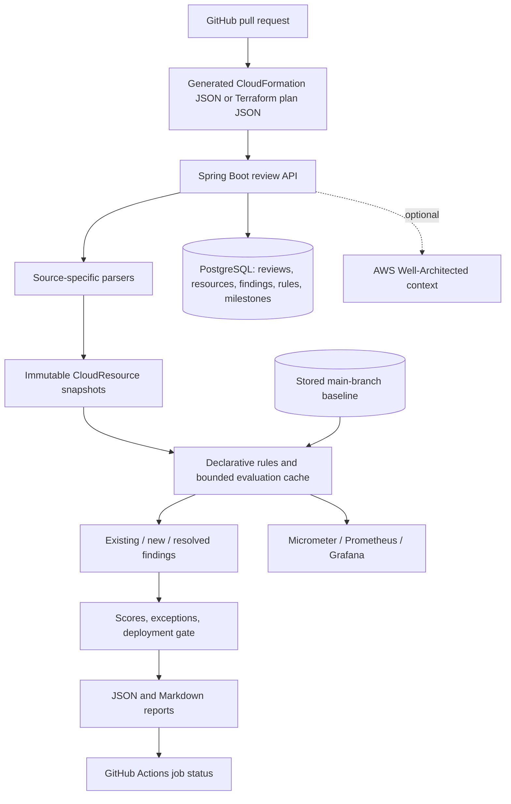
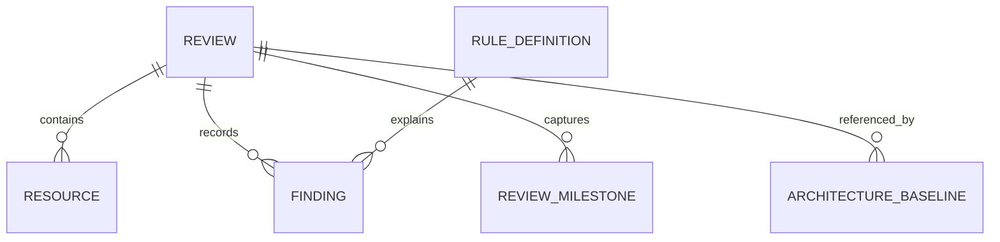

# Architecture

The parser owns source translation. Policy evaluation owns no Terraform or CloudFormation parsing. Properties use CloudFormation property names (`MultiAZ`, `StorageEncrypted`) as the canonical vocabulary. Terraform normalization has explicit exceptions for acronyms and singleton blocks.

The service evaluates baseline and proposal with the **same currently loaded rule catalog**. This separates configuration regressions from policy-version changes. Reports preserve old results as immutable history; a named baseline points to a stored normalized snapshot, not its old finding list.

Creation runs inside one database transaction. A PostgreSQL advisory transaction lock on `Idempotency-Key` serializes duplicate requests across replicas. Identical requests return the same report; conflicting bodies return HTTP 409. Without a key, every request creates a review. Locks are database-wide and collisions only serialize unrelated keys. Milestones have a unique `(review_id, name)` key. Database commits include snapshots, report, policy versions, exceptions, and findings together.

Cache entries hold immutable `(complete rule definition, complete CloudResource)` keys, bounded by entry count and ten-minute idle expiration. They contain only rule outcomes. IDs, exceptions, baseline classifications and gate decisions are recomputed for every review. Failed evaluations are not cached. Worker threads use a bounded queue and caller-runs backpressure; the default is sequential. Source-level templates never become executable code.

The AWS adapter is optional and synchronous, with SDK retries and bounded attempt/overall timeouts. Static scanning is independent of AWS availability. AWS context is read separately and is not converted into a fabricated framework compliance score.

## Data relationships

Flyway owns schema changes. JPA manages the review aggregate; JDBC batches resource/finding rows in the same Spring transaction. Rules are keyed by `(id, version)`; changing a stored rule without increasing its version aborts the new review. Stored snapshots can contain infrastructure secrets and need database encryption, controlled access and a retention policy in production.
